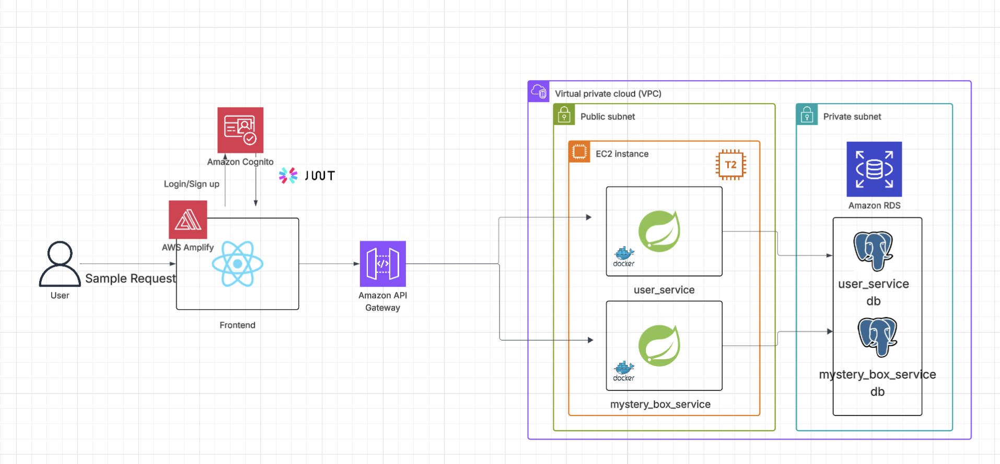
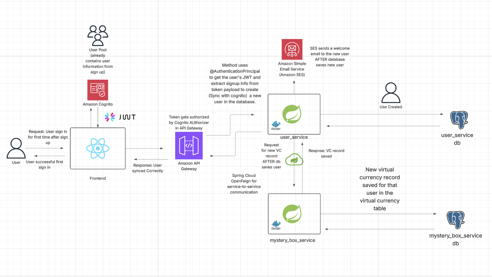

# Cloud Microservices Mystery Box Application 

This project demonstrates a microservices architecture deployed on AWS, integrating frontend and backend services with secure authentication and scalable infrastructure.

---

## Architecture Diagram

---
## Goals and Trade-offs

Goal: Build a cloud-native microservice application while staying within the AWS Free Tier as much as possible. As a student, I understand this comes with certain limitations, but it's a practical way for me to gain hands-on experience with real-world cloud infrastructure at minimal cost.

Limitations:

- RDS Instance is not highly available or resistant to failure due to being in one subnet which leaves it in one AZ
    - Hypothetical Solution: I would use RDS Multi-AZ + Read Replicas to allow for failover in case of AZ outages, reduce downtime during maintenance, and improve read scalability for high-traffic workloads. This setup ensures better fault tolerance and performance but incurs additional cost outside the Free Tier.
- EC2 application instances are not highly available due to being deployed in a single Availability Zone (AZ), creating a single point of failure.
    - Hypothetical Solution: I would deploy multiple EC2 instances across multiple AZs behind an Application Load Balancer (ALB) to ensure high availability, distribute traffic evenly, and maintain       uptime during AZ outages or instance failures. This architecture improves resilience but exceeds Free Tier limits.
- The EC2 instance running the application is placed in a public subnet, which means it is associated with a subnet that has a route to an Internet Gateway. This setup allows the instance to be assigned a public IP address, enabling it to send and receive traffic directly over the internet
    - Hypothetical Solution (Part 1) : In a production setting, I would place my application (and any distributed instances of it) in private subnets, where instances are only assigned private IP addresses. This improves security by preventing direct access from the internet. For outbound internet access (e.g., downloading packages or updates), I would configure a NAT Gateway in a public subnet. The NAT Gateway would translate private IPs to a public one, allowing secure internet access without exposing the instances directly.
    - Hypothetical Solution (Part 2) : In the case of distributed copies, I wouldn’t be able to just use API Gateway and would have to use an Application Load Balancer (ALB) instead. This is because an ALB can route and distribute incoming HTTP/HTTPS traffic across multiple EC2 instances running in different Availability Zones, ensuring high availability, fault tolerance, and efficient traffic management. API Gateway, on the other hand, is better suited for serverless architectures (e.g., Lambda functions) and managing RESTful or WebSocket APIs, rather than directly balancing load between EC2 instances.
---

## Components

### User
- Initiates requests via frontend interface.

### Frontend
- Built with React and hosted on AWS Amplify.
- Uses Amazon Cognito for user authentication.
- Utilizes JWT tokens for secure API communication.

### API Gateway
- Amazon API Gateway routes frontend requests to backend services.

### Backend Services (EC2 Instances in Public Subnet)
- Two Spring Boot microservices (`user_service` and `mystery_box_service`) running inside Docker containers on T2 EC2 instances.
- These services handle business logic and communicate with their respective databases.

### Databases (Private Subnet)
- Amazon RDS PostgreSQL databases for each microservice (`user_service_db` and `mystery_box_service_db`).
- Databases are in a private subnet for security.

### Networking
- All components are deployed within a Virtual Private Cloud (VPC).
- Public subnet hosts the EC2 instances.
- Private subnet hosts the databases.

---

## Sign Up Flow

### 1. User Authentication
1. User initiates first-time sign-in after registration
2. Frontend sends authentication request to Amazon Cognito
3. Cognito validates credentials and returns JWT token

### 2. User Creation Process
1. Cognito Authorizer on API Gateway authorizes JWT token
2. `@AuthenticationPrincipal` extracts user information from token payload
3. user_service creates new user record in database
4. System triggers welcome email via Amazon SES

### 3. Virtual Currency Initialization
1. After user creation, system requests new virtual currency record
2. mystery_box_service creates initial VC record for new user
3. New virtual currency record saved in mystery_box_service database

### 4. Service Communication
- **Spring Cloud OpenFeign** facilitates service-to-service communication
- Both services run in Docker containers for consistency and scalability

## Key Features

- **Secure Authentication** - JWT-based authentication with Amazon Cognito
- **Microservices Architecture** - Separation of user management and virtual currency services
- **Automated Onboarding** - Welcome emails and virtual currency initialization
- **Containerized Deployment** - Docker containers for all services
- **Database Isolation** - Separate databases for different service domains

---

## Technologies Used

- React
- AWS Amplify
- Amazon Cognito
- JWT
- Amazon API Gateway
- Spring Boot
- Docker
- Amazon EC2 (T2 instances)
- Amazon RDS (PostgreSQL)
- AWS VPC

---

## Security Considerations

- Authentication handled via Amazon Cognito and JWT.
- Backend databases are isolated in private subnet.
- EC2 instances are in a public subnet, but only expose necessary services.
- Secure communication enforced throughout.

## Currently Working

- Finishing up UI
- Choosing between hosting frontend on Amplify or S3 + CDN
- Due to Spring Cloud version compatability issues, I have to reimplement service-service-communication using OpenFeign

---

## License

This project is licensed under the MIT License.  
See the [LICENSE](LICENSE) file for details.
